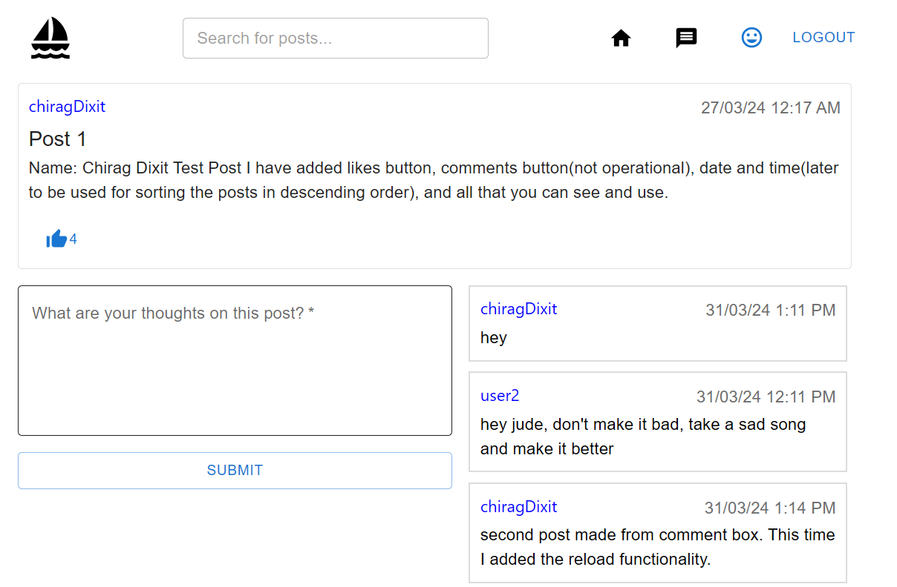

# Social Media Application

Welcome to our Social Media Application, where connections are made, voices are heard, and communities thrive. Our platform offers a dynamic and interactive space for users to engage with each other, share their thoughts, and explore a diverse range of content. Create your profile, share posts and blogs, like and comment on others' contributions, and connect with people from all around the globe. Join us and be a part of a vibrant online community where your voice matters!

## Features

- **Dynamic Social Platform:** Interact with people across the globe on a vibrant and engaging platform.
- **Create Your Profile:** Personalize your experience by creating your own profile with a unique bio.
- **Make Posts and Blogs:** Share your thoughts, ideas, and experiences with the world through posts and blogs.
- **Like Posts:** Show appreciation for posts by liking them, whether they're from other users or your own.
- **Comment on Posts:** Share your opinions and engage in discussions by leaving comments on posts. Your voice matters!

## User Interface

## Technology Stack

| Technology    | Description                                                                                      | Usage in Project                                                                                   |
|---------------|--------------------------------------------------------------------------------------------------|----------------------------------------------------------------------------------------------------|
| React         | A JavaScript library for building user interfaces.                                               | Used as the core frontend library to create the user interface components.                         |
| Redux         | A predictable state container for JavaScript apps.                                                | Implemented Redux for managing the application's state in a predictable and centralized manner.     |
| Material UI   | A popular React UI framework for building beautiful, responsive web applications.               | Utilized Material UI components for designing a visually appealing and responsive user interface.   |
| Firebase      | A comprehensive platform provided by Google for building mobile and web applications.            | Integrated Firebase for user authentication and Firestore for real-time data storage and retrieval. |
|               | - Authentication: Firebase Authentication provides backend services, easy-to-use SDKs, and ready-made UI libraries to authenticate users to your app. | Implemented Firebase Authentication for user sign-in and sign-up functionality.                     |
|               | - Firestore: Firebase's flexible, scalable database for mobile, web, and server development.     | Utilized Firestore as the database to store and sync app data in real-time across clients.          |
| Netlify       | A powerful platform for deploying modern web projects.                                             | Deployed the application on Netlify for hosting, continuous integration, and continuous deployment. |

## Getting Started

To run the application locally, follow these steps:

1. Clone the repository: `git clone <repository-url>`
2. Install dependencies: `npm install`
3. Start the development server: `npm start`

## Deployment

The application is deployed on Netlify. You can access it [here](<netlify-app-url>).

## Contributing

Contributions are welcome! Feel free to open an issue or submit a pull request.
